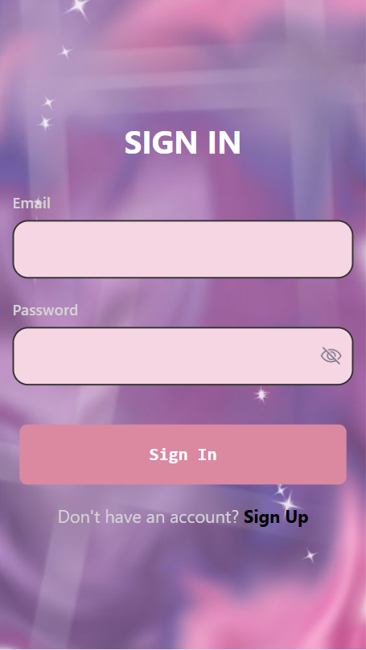
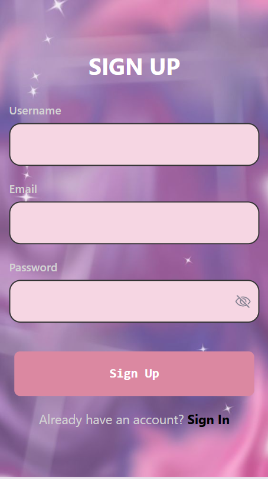
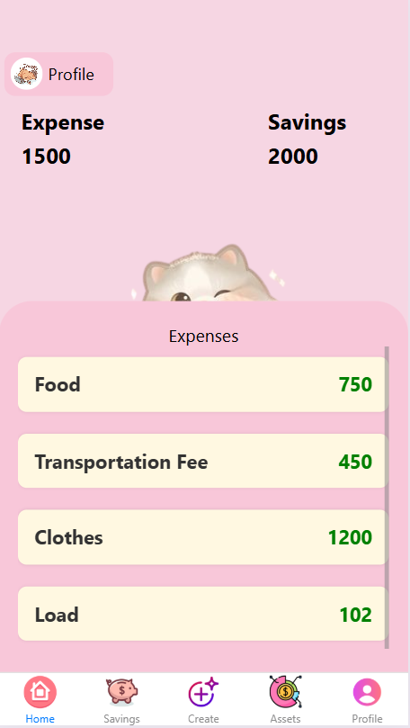
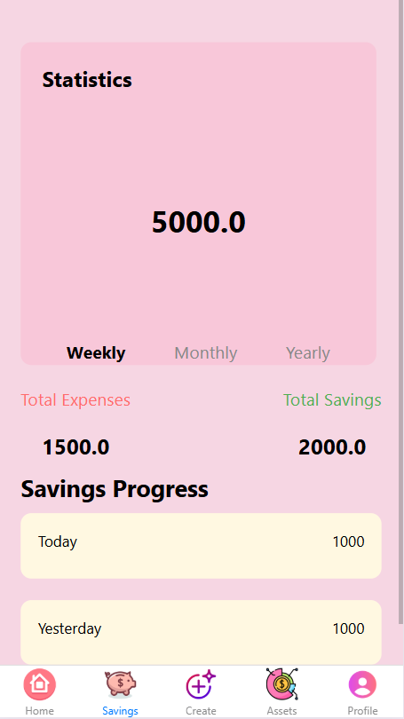
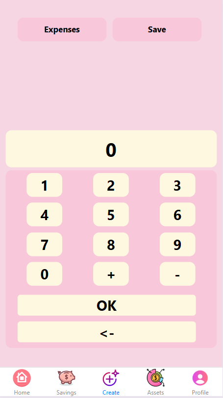
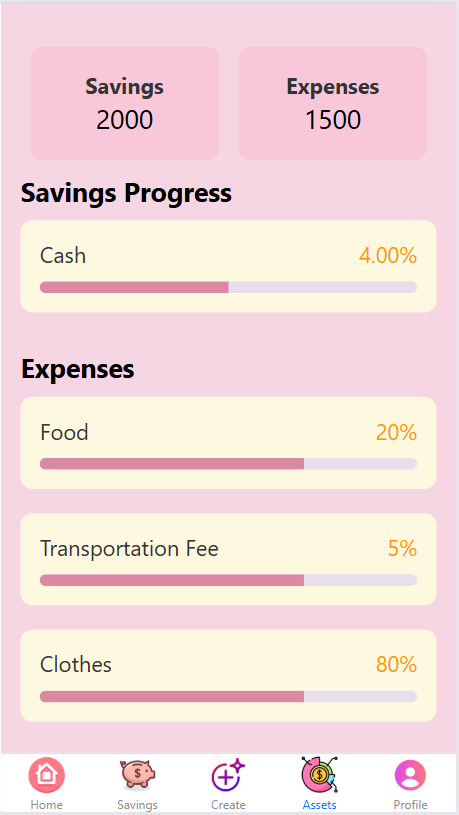

# Money Manager
Money Manager Mobile App.

# Features
Share Projects
Message other developers
Rate others work
Search other developers

# Course Overview
Basic React Native Components
Database Design using Appwrite
User Registration & Authenticaiton
Deployment

# My Stack
React Native
AppWrite
HTML, CSS and JS

# Landing Page
</img>

# Sign In Screen
</img>

# Sign Up Screen
</img>

# Tabs Screen
</img>

# Home Screen
</img>

# Savings Screen
</img>

# Create Screen
</img>

# Assets Screen
</img>

# Profile Screen
</img>
